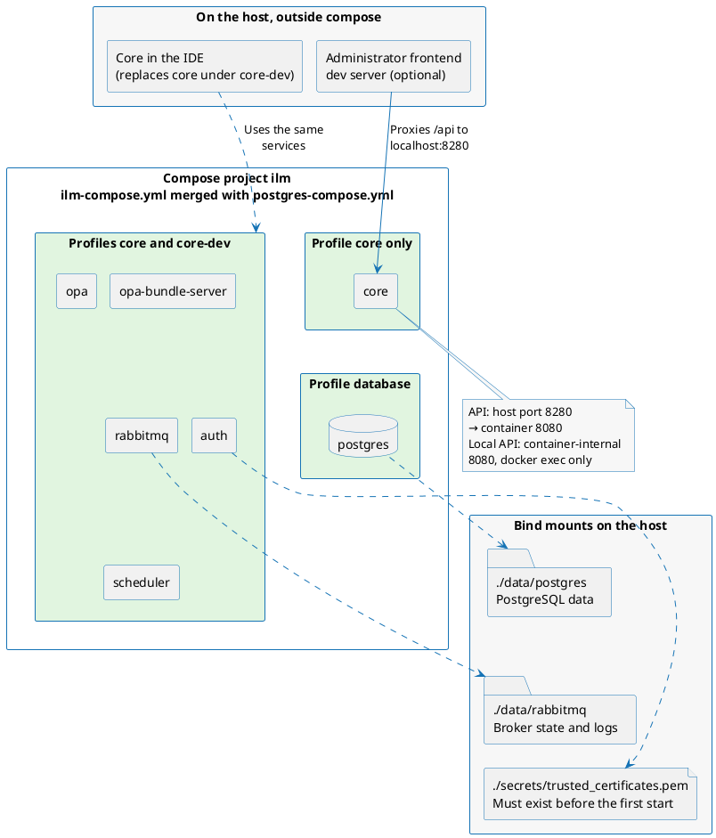

# Development environment

The [development-environment](https://github.com/OmniTrustILM/development-environment) repository contains the Docker Compose files and helper scripts that stand up a local development environment for the platform. Several services need to be running during development, and Compose profiles select which of them start — from the core services alone to the full set of connectors — depending on the service you are going to work on.

## What the environment runs

Everything runs as one Compose project named `ilm`, merged from two files: `ilm-compose.yml` defines the platform services and the connectors, and `postgres-compose.yml` adds the PostgreSQL database. Profiles select what actually starts — the `database` profile brings up `postgres`, the `core` profile brings up the core services (`opa`, `rabbitmq`, `auth`, `opa-bundle-server`, `scheduler`, and `core`), and the `core-dev` profile brings up the same set without `core` so that you can run Core from the IDE instead. Most images build from your local source checkouts; the `core` service runs a prebuilt development image by default.



The Core API is published on host port `8280` (mapped to container port `8080`). The Local API, used to register the first administrator, answers only requests from the `core` container's own localhost, so it is not reachable through the published port — call it with `docker exec` (see [Authentication](#authentication)). State lives in bind mounts under the repository root: the PostgreSQL data under `./data/postgres`, the broker state and logs under `./data/rabbitmq`, and the trusted CA bundle at `./secrets/trusted_certificates.pem`.

## Prerequisites

- Docker with the Compose plugin (Compose v2, the `docker compose` command).
- Local checkouts of the platform source repositories, cloned under one base directory. Most services in `ilm-compose.yml` build their images from these sources.
- A PostgreSQL database — either the bundled one in `postgres-compose.yml` (see [Database](#database)) or your own instance.

## Source repository directory naming

The `build:` paths in `ilm-compose.yml` reference source directories under `${ILM_SOURCES_BASE_DIR}` using their lowercase repository names (matching the `OmniTrustILM/<repo>` GitHub convention) — for example `${ILM_SOURCES_BASE_DIR}/auth`, `${ILM_SOURCES_BASE_DIR}/scheduler`, `${ILM_SOURCES_BASE_DIR}/ejbca-ng-connector`.

:::warning[Rename legacy source directories first]

If your checkout predates the current repository names and still uses older mixed-case directory names, rename each directory to the lowercase form above before running `docker compose up`, otherwise the build fails with `path not found`.

:::

## Configure the environment variables

Create a `.env` file in the root of the repository and update the values. The `.env.example` file can be used as a template with the following values:

| Variable | Description |
|---|---|
| `ILM_SOURCES_BASE_DIR` | Path to the directory where the platform sources are located for building the images. |
| `DB_HOST` | Hostname of the PostgreSQL database. Keep the default value if you are using the PostgreSQL in Docker. |
| `DB_PORT` | Port of the PostgreSQL database. Keep the default value if you are using the PostgreSQL in Docker. |
| `DB_HOST_PORT` | Host port that the bundled PostgreSQL container is published on (`postgres-compose.yml` maps `DB_HOST_PORT` on the host to `DB_PORT` in the container). Only used by the PostgreSQL in Docker. |
| `DB_USERNAME` | Username for the PostgreSQL database. Keep the default value if you are using the PostgreSQL in Docker. |
| `DB_PASSWORD` | Password for the PostgreSQL database. Keep the default value if you are using the PostgreSQL in Docker. |
| `DB_NAME` | Name of the PostgreSQL database. Keep the default value if you are using the PostgreSQL in Docker. |
| `DB_SSLMODE` | PostgreSQL SSL mode for services whose datasource is configured through `JDBC_URL` (`disable`, `prefer`, `require`, `verify-ca`, `verify-full`). Defaults to `disable`, suitable for local development against the bundled or a host PostgreSQL. Services configured through other database settings are not affected. |
| `SMTP_HOST` | Hostname of the SMTP server. Used with the `email-notification-provider` service. |
| `SMTP_USERNAME` | Username for the SMTP server. Used with the `email-notification-provider` service. |
| `SMTP_PASSWORD` | Password for the SMTP server. Used with the `email-notification-provider` service. |
| `GITHUB_USERNAME` | Username for the GitHub account to get the packages, if necessary. |
| `GITHUB_PASSWORD` | Password for the GitHub account to get the packages, if necessary. |

### Trusted CA certificates

If you are using self-signed or not publicly trusted certificates, add the CA certificate to the trusted certificates in Docker. Add the CA certificate to the `./secrets/trusted_certificates.pem` file and it will be automatically mounted into the `auth` container, the service that verifies client certificates.

The file contains CA certificates in the PEM format. You can add multiple certificates to the file. The repository already tracks this file, seeded with the legacy development dummy root CA, so a fresh clone starts with a valid PEM bundle in place.

:::warning[Create the certificates file before the first start]

The `./secrets/trusted_certificates.pem` file must exist before starting the services, otherwise Docker will fail to mount it. Create it before the first `docker compose up`, even if it is empty:

```bash
touch secrets/trusted_certificates.pem
```

If you are using the dummy certificates for development (see [Authentication](#authentication)), add the [ILM Dummy Root CA](https://github.com/OmniTrustILM/helm-charts/blob/main/dummy-certificates/certs/root-ca.cert.pem) to this file and restart the `auth` service:

```bash
docker compose -f ilm-compose.yml -f postgres-compose.yml --profile core restart auth
```

:::

## Quick start

Copy the `.env.example` file to `.env` and update `ILM_SOURCES_BASE_DIR` with the path to the platform sources on your machine. For a quick start, use the following command to start the environment for the core services with the PostgreSQL database in Docker:

```bash
docker compose -f ilm-compose.yml -f postgres-compose.yml --profile database --profile core up
```

This merges the `ilm-compose.yml` and `postgres-compose.yml` Compose files and starts the PostgreSQL database and the core services according to the `database` and `core` profiles.

To stop the services, use the following command:

```bash
docker compose -f ilm-compose.yml -f postgres-compose.yml --profile database --profile core down
```

## Profiles

The Compose files define profiles that can be used to start the required services based on what you are going to work on. The profiles are:

| Profile | Services | Description |
|---|---|---|
| `core` | `opa` `rabbitmq` `auth` `opa-bundle-server` `scheduler` `core` | Starts the core services of the platform. |
| `database` | `postgres` | Starts the PostgreSQL database. |
| `core-dev` | `opa` `rabbitmq` `auth` `opa-bundle-server` `scheduler` | Starts services that are needed for the development of the Core service. |
| `all` | Every service — each service definition in both Compose files carries the `all` profile. | Starts all services. |

Each service can also be started separately using the profile named `[service name]-standalone`. The one exception is the `utils` service, whose dedicated profile is named `utils`.

### Developing the Core service

To start the services that are needed for the development of the Core service, use the `core-dev` profile:

```bash
docker compose -f ilm-compose.yml --profile core-dev up
```

Once the services are started, you can start the Core service in your favorite IDE and connect it to the running services.

## Database

The platform requires a PostgreSQL database to store its data. The database can be started in Docker using the `postgres-compose.yml` file, or you can use your own database. Database access is configured using the [environment variables](#configure-the-environment-variables) in the `.env` file.

### Using PostgreSQL in Docker

The `postgres-compose.yml` file contains the PostgreSQL database service. The database is used by the core services and the services that require a database. The container is published on the host port set by `DB_HOST_PORT`, and the file also defines an `adminer` service on the `all` profile, published on host port `8088`, for browsing the database.

By default the database stores its data under the `./data/postgres` directory, so the data persists even when the database is stopped. If the folder does not exist, it is created.

To start the PostgreSQL database in Docker, use the following command:

```bash
docker compose -f postgres-compose.yml --profile database up
```

To stop the PostgreSQL database, use the following command:

```bash
docker compose -f postgres-compose.yml --profile database down
```

To remove the data and start the database from scratch, remove the `./data/postgres` directory.

:::warning[Removing the data directory deletes the database]

The `./data/postgres` directory contains the data of the PostgreSQL database. Removing it removes all data stored in the database. Make sure to back up the data before removing the directory, if necessary. Note that the parent `./data` directory also holds the broker state under `./data/rabbitmq` — remove only the subtree you mean to reset.

:::

## Messaging

The `rabbitmq` service mounts `./rabbitmq/definitions.json` and `./rabbitmq/rabbitmq.conf` into the container. On boot the broker imports the topology (the vhost, the `ilm` exchange, the queues and their bindings, and the `guest` admin user) from `definitions.json`. The data directory is bind-mounted at `./data/rabbitmq/data` so broker state persists across restarts.

:::note[Restart the broker after adding a queue or binding]

The import runs only at broker boot, and `definitions.json` is bind-mounted — editing it does not change the service configuration, so `docker compose up` leaves an already-running broker untouched and reports it as up-to-date. After pulling or making an additive topology change, restart the broker so it re-imports:

```bash
docker compose -f ilm-compose.yml --profile core restart rabbitmq
```

Confirm the new topology is live:

```bash
docker compose -f ilm-compose.yml --profile core exec rabbitmq rabbitmqctl list_queues name
```

:::

:::warning[Wipe persisted broker state after a conflicting topology change]

Adding queues and bindings merges cleanly into an existing broker, so a restart is enough. A wipe is needed only for a *conflicting* change: if the broker logs `PRECONDITION_FAILED` errors during the definitions import (typically because previously created queues have different attributes than the new declarations), wipe the persisted state and restart:

```bash
docker compose -f ilm-compose.yml down
rm -rf ./data/rabbitmq/data
docker compose -f ilm-compose.yml --profile core up
```

The next boot imports `definitions.json` against an empty Mnesia store and the topology will match the file exactly.

:::

## Authentication

The platform authenticates users with the client certificate on the mTLS-enabled port. For development purposes, you can use the non-TLS port and simulate the authenticated user by sending the `ssl-client-cert` header with the URL-encoded Base64 certificate.

:::warning[URL-encode the certificate value]

The certificate value must be **URL-encoded** (e.g. `+` → `%2B`, `=` → `%3D`). Sending a plain Base64 value will cause the `+` characters to be interpreted as spaces, resulting in an authentication error.

:::

You can register the certificate for the first administrator using the [Local API](%API_BASE_URLcore-local/#tag/Local-operations/operation/addAdmin). For development purposes, you can use the [ILM Administrator](https://github.com/OmniTrustILM/helm-charts/blob/main/dummy-certificates/certs/admin.cert.pem) certificate.

:::warning[The Local API is reachable only inside the container]

The Local API answers only requests from the `core` container's own localhost and requires no authentication. The externally mapped port `8280` exposes the regular API, which requires client-certificate authentication and returns HTTP 401 without one. Use `docker exec` to call the Local API from inside the container — run this from the repository root, since the request body is piped in from `scripts/first-admin.json` (nothing mounts it into the container):

```bash
docker exec -i core curl -X POST \
  -H 'content-type: application/json' \
  -d @- \
  http://localhost:8080/api/v1/local/admins < scripts/first-admin.json
```

:::

The bundled `scripts/first-admin.json` registers the same [ILM Administrator](https://github.com/OmniTrustILM/helm-charts/blob/main/dummy-certificates/certs/admin.cert.pem) dummy certificate used in [Administrator frontend](#administrator-frontend), so the bootstrapped administrator can sign in through the proxy immediately — no certificate swap is needed.

To create the administrator, follow [Create Super Administrator](https://docs.otilm.com/docs/certificate-key/installation-guide/create-super-administrator).

Additional users and roles can be added using the platform API or the Administrator UI.

## Administrator frontend

To run the Administrator frontend against the backend services for development, start the development server in the [fe-administrator](https://github.com/OmniTrustILM/fe-administrator) repository.

Create a `src/setupProxy.js` file in the root of that repository with the following content. The `ssl-client-cert` value below is the published dummy development certificate of the ILM Administrator — it is not a secret, and it is kept complete here so the example works when copied as-is:

```javascript
const proxyConfig = {
    server: {
        proxy: {
            '/api': {
                target: 'http://localhost:8280',
                changeOrigin: true,
                secure: false,
                headers: {
                    // URL-encoded Base64 certificate of the ILM Administrator
                    'ssl-client-cert': 'MIIEmDCCAoCgAwIBAgIUSpLD/%2BgTWhMxIlMog2Bdlm3CDjUwDQYJKoZIhvcNAQENBQAwGDEWMBQGA1UEAwwNRHVtbXkgUm9vdCBDQTAeFw0yNjA0MjAxNDQyMTdaFw00NjA0MTUxNDQyMTdaMBgxFjAUBgNVBAMMDUFkbWluaXN0cmF0b3IwggEiMA0GCSqGSIb3DQEBAQUAA4IBDwAwggEKAoIBAQC00ipGosoB9c%2BJ0xNOZxeCBzVCO14OvQ1Wx1apYy6mIb9prbW%2BJDzzC9PV/Vq/3jARGe7n1nCklzGWESfGzBB%2BDXRO0z1A%2BBRJ2jDh6/wym4atB45R9dkfDbhTFmWVmNPVrc5qYkC3JJhmeuhJcz71XBsSL7l9/3qdruXB/ZeBHSkJLkHVoEviacejKGi9ajuNY0Oo4wY7GDN%2BS8RQP4X84kKxzJRSwcT883/kHq2b83pwSygxfLUcz0FLfJeGNf0NtD%2BACurznbUELrNDF/xYGJeCnxssmTOyx4BtzA0RLINw4ews8%2BmPW0frBoCmx7KpQheT7hWYTGZaumVCVCMbAgMBAAGjgdkwgdYwDAYDVR0TAQH/BAIwADAOBgNVHQ8BAf8EBAMCBeAwEwYDVR0lBAwwCgYIKwYBBQUHAwIwHQYDVR0OBBYEFKP9zS5hQtIMB4Xhm3asjv/ZC0QpMB8GA1UdIwQYMBaAFKrDVRKMwNLPigRWgvEnfgyfERiyMGEGA1UdIARaMFgwVgYEVR0gADBOMEwGCCsGAQUFBwICMEAMPlRoaXMgaXMgYSBkdW1teSBhZG1pbmlzdHJhdG9yIGNlcnRpZmljYXRlIGZvciB0ZXN0aW5nIHB1cnBvc2VzMA0GCSqGSIb3DQEBDQUAA4ICAQBfCGjQPlYTy1J3o94tGlE26Jwy8b3z/x3zNjztZ4QX5wAIkiUoT24DcZsZp9rlKMHsr4Dcv/JcBKnNrfYD%2BESCEXcZcuUIBbv4oErY%2BfAsmp6gW62gQnDF6GZCfz%2BKiTy%2BvtB493yvbKFepNfI5lgnVh443iD3TSbFmQYfeWLYYyqwjgNxFnPffPZ6w2cV7xw5pmF3FI5RM5SBhSEl0U3Aqbvnklw3A5mHis4t4joaptksg%2ByVExt38azhS34eIkGUbiGKsfbgr7%2BqaaqX1MRSrjE5FVh9uCs5ALmHBiZ5iEX1i3NwmLoqth71%2BAD11yUgX6LGp/kc85OIk1mjkom27ncY%2BwQ5lSZKuK8Ts1zQSD8iGalL7RSNnRALr%2B97mDBeZJYBBGPiEYj7UUC0NKw7qcLQ5bowfHnBZUAZbXWdR5AJa7VsPDH6k9Cvy/R9h0miyQF2QMs3%2BmYHLNdLTzqSkUq9XYnZWbm7CwprH1dW2iW78PdfOtDl90MhbGkVR50xpHNC3hwdBe0hV9RIw46Qtwb8PZSJq8EFlNrSK0J7882JwG8CDhOBxgzQGAahv3wb0B1/W3LRVbR1D9UyvDKN121uw025lJ%2BrCTUJ5T%2BfepyQxdvkH%2BIrmNvkh0kcZISG1If4HASDWFN9OMjvNesiRFHgpNZ26Xh347DfNvNrXQ%3D%3D',
                },
            },
        },
    },
};

export default proxyConfig;
```

This proxies the requests from the frontend to the backend services, authenticated and authorized with the certificate in the `ssl-client-cert` header.

:::warning[Keep the proxy configuration local]

The `src/setupProxy.js` file is gitignored — each developer creates their own local copy. Do not commit this file.
The certificate value must be URL-encoded. To generate the value for your own certificate, use `node -e "console.log(encodeURIComponent('<base64_cert>'))"`.
Certificates that should be trusted by the `auth` service must be added to `trusted_certificates.pem` (see [Trusted CA certificates](#trusted-ca-certificates)).

:::

## Scripts

The `scripts/` directory contains helper scripts for one-time setup tasks. They run on the host and need `curl`; `timestamping-setup.sh` additionally requires `jq` and `base64`.

### bootstrap-first-admin.sh

Registers the first administrator account by POSTing `scripts/first-admin.json` to the Local API. Because the Local API answers only requests from Core's own localhost, the script works against a Core you run in the IDE — for a compose-run Core, use the `docker exec` command shown in the [Authentication](#authentication) section instead.

```bash
# Core running in the IDE (the default, http://localhost:8080)
./scripts/bootstrap-first-admin.sh

# Core listening on a non-default host or port
./scripts/bootstrap-first-admin.sh --ilm-host http://localhost:8081
```

The account is registered with the dummy certificate bundled in `scripts/first-admin.json`. To register a different certificate, pass `--client-cert-pem`.

```bash
./scripts/bootstrap-first-admin.sh --client-cert-pem /path/to/admin.cert.pem
```

### timestamping-setup.sh

End-to-end provisioning script that creates all the platform objects required for a timestamping environment: five connectors, a SoftKeyStore credential, an EJBCA authority, a soft token and token profile, a Time Quality configuration, a vault instance and vault profile, a mapped user and role, and two TSA sets (non-qualified and qualified), each with a key pair, RA profile, certificate, TSP profile, signing profile, and Basic credential.

The connector services it registers must already be running — start them with the `all` profile or their `[service name]-standalone` profiles. The defaults expect the Compose port mappings: `common-credential-provider` on `8200`, `ejbca-ng-connector` on `8210`, `software-cryptography-provider` on `8230`, and `timestamp-formatting-connector` on `8270`.

```bash
./scripts/timestamping-setup.sh \
  --pkcs12-bundle /path/to/ejbca-client.p12 \
  --certificate-dn "tsa.example.com" \
  --client-cert-pem /path/to/admin.cert.pem
```

The `--certificate-dn` value is used directly as the certificates' common name prefix — the issued CNs are `<value>-non-qualified` and `<value>-qualified`, so pass a bare name, not a `CN=` string.

Run `./scripts/timestamping-setup.sh --help` for the full option list (connector ports, EJBCA profiles, object name bases, polling tunables, and more).

## Connectors and technologies

To have a complete setup, you need a technology available for the connectors. For example, if you would like to work with the Authority Provider functions, you should have an appropriate connector running that is able to communicate with the target technology.
